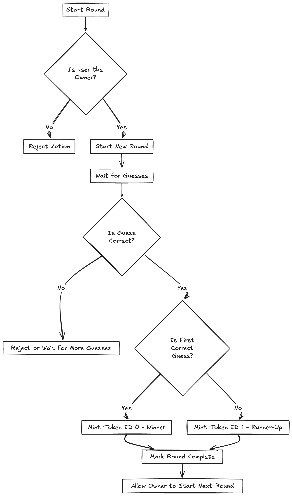

# ZK Panagram

This is a game-like mechanism built on an ERC-1155 NFT contract, where each "answer" constitutes a new round. Only the contract owner can initiate a round, and each must last a minimum duration before completion. Participants submit guesses, which are verified by calling an external Verifier smart contract. If a guess is correct, the first user to submit it is recognized as the winner and is minted an NFT with token ID 0. Other users who also guessed correctly, but not first, receive an NFT with token ID 1, serving as runner-up tokens. The issuance of these distinct NFTs not only incentivizes early and accurate responses but also creates a verifiable on-chain record of participation and success across rounds, enabling collectible or reputational use cases. A new round can only begin once a winner has been identified, ensuring structured progression through the game.

## Invariants and requirements
- Each answer is a round
- The owner will be the only person that can start a new round
- The round needs to have a minimum duration
- There needs to be a winner to start the next round
- The contract needs to be an NFT contract
 - ERC-1155 -> (token id 0 for winners, token id 1 for runners up)
 - Mint ID 0 if the user is the first person to guess correctly in the round
 Mint ID 1 if they gor it correct but they are not the first in that round
- To check if the user's guess is correct, we will call the Verifier.

--- 

## Class Notes
